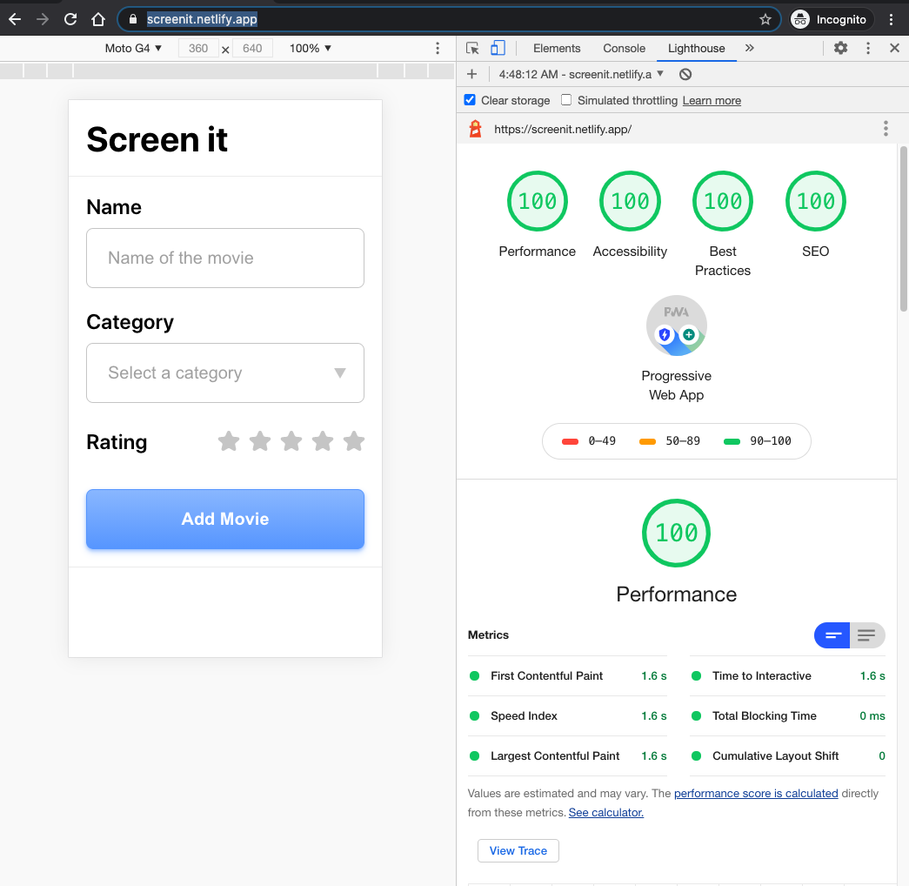
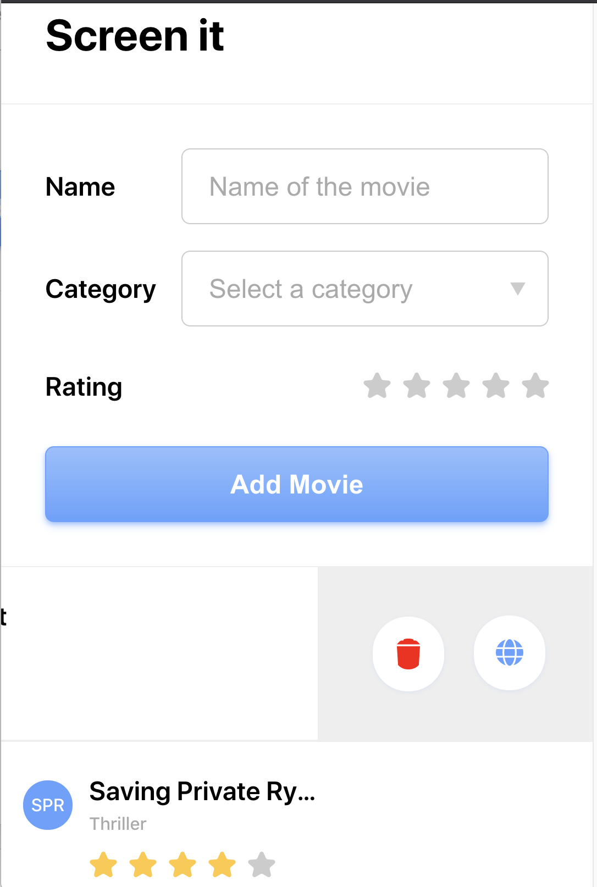

# screen-it

**Objective:** Recreate the provided movie tracker design using HTML/CSS/JS but preferably with React, within 24 hours.

**Deployed:** https://screenit.netlify.app/

**Figma Link:** https://www.figma.com/file/54b1hamTwUweFUhBcpyKfP/See-It-Updates?node-id=113%3A1

---
## Version 3
*These items were added after the initial 24 hour deadline.* 

#### Key Features 

* Added about 10 new components, implementing greater "Separation of concerns". This also allowed for small components (like icons and modals) to be reused across the app. 
* Updated name, created logo and made many minor misc ui updates. 
* Added illustrations for the default state.
* Added a toggle button to switch between card and list view
* Removed categories dropdown, instead pulling these from the API
* Fixed some accessibility errors

---

## Version 2

*These items were added after the initial 24 hour deadline.* 

#### Deployed Link v2
https://screenit2.netlify.app/

#### GitHub Branch 
https://github.com/GedalyaKrycer/screen-it/tree/upgrades

#### Figma Link
https://www.figma.com/file/54b1hamTwUweFUhBcpyKfP/See-It-Updates?node-id=113%3A1

#### Key Features 

* Star Ratings have been refactored from two to one component. 
* Stars Ratings now feature a GSAP3 animation when 5 are selected. 
* Results row demonstrates interactivity with a new css animation hover state and iconography.
* Results row features an improved UI.
* Result tools feature improved icons.
* Edit functionality has been added for results.
* Local storage has been added to preserve entries. 
* Clear All button removes all entries at once and disables when no entries are there. 
* Fixed several bugs from v1.

---

## Version 1

*These items were completed within the initial 24 hour deadline.* 

#### Deployed Link v1
https://screenit1.netlify.app/

#### Figma Link v1
https://www.figma.com/file/QDFXvzCesbB6eX0gDPSsAQ/Planning-Center-V1-Coding-Challenge?node-id=0%3A1

#### GitHub Branch 
https://github.com/GedalyaKrycer/screen-it/tree/v1

#### Key Features 

* **Trello:** To help with your evaluation and my production process the entire project was tracked in this [Trello board](https://trello.com/b/s8Ciuzfa). This allows further transparency into my workflows, such as [time spent](https://trello.com/c/te2ZPyp6), [tutorials used](https://trello.com/c/ZQ6hs0bG), and much more. 

* **Figma:** To help simulate my typical design approach, I also rebuilt the provided design in Figma. (Still keeping the original layout spec.) This includes a small design system that has new components, color styles, and font styles. Doing so helped streamline the process in the long run when I had to add to the design for additional features. 

* **Tech:** This app has been built with React and uses ES6+ JS, Hooks, Props, and a Context Provider. I stayed away from using CSS frameworks like Bulma or Bootstrap, and instead opted to leverage custom styles with CSS Grid, FlexBox, CSS variables, etc.

* **PWA:** This site is also a Progress Web Application, which allows it to be downloaded to a computer or tablet as an offline "app". It scores 100% across the board in Google Chrome's Lighthouse report. 
 

* **Commenting:** Attention was paid to adding comments to the code to explain functions and creating TOC in longer style sheets.

* **Responsive Layouts:** In addition to the 640px size, I also took some liberties and added additional styles for larger / smaller breakpoints. This prevented the layout from breaking, while still staying within the general theme of the design. 
  

* **API Intergration:** Clicking on a movie result will allow you to delete it or visit the IMDB page. This IMDB link is accomplished by combining the OMDB API data (via Axios get request), with a query string on the IMDB URL. 
  

* **Form Validation:** Some simple validation has been added to the filters to make sure they are included and to the API request. If no movie exists, then a placeholder is given.

* **Avatars:** Avatars show up the first character of up to the first 3 words. If there are more than two characters the font size gets smaller dynamically. 

* **Overflow Text:** The Movie name hides overflow text and shows an ellipse after a preset width, which changes based on different breakpoints.

